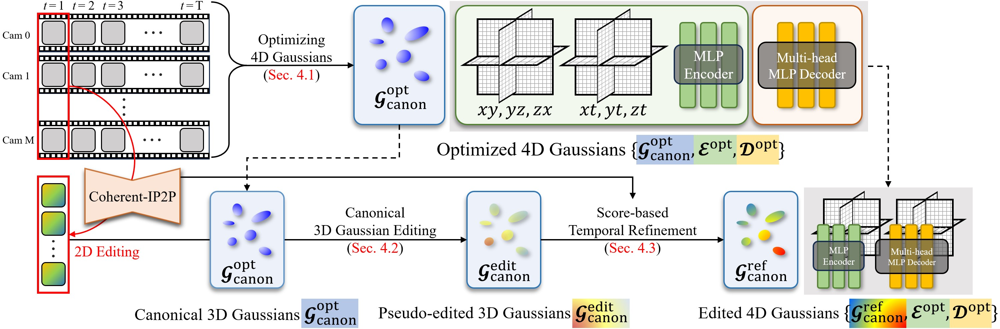

# Instruct-4DGS: Efficient Dynamic Scene Editing via 4D Gaussian-based Static-Dynamic Separation

## CVPR 2025

### [[Project Page]](https://hanbyelcho.info/instruct-4dgs/) | [[Paper]](https://openaccess.thecvf.com/content/CVPR2025/html/Kwon_Efficient_Dynamic_Scene_Editing_via_4D_Gaussian-based_Static-Dynamic_Separation_CVPR_2025_paper.html) | [[arXiv]](https://arxiv.org/abs/2502.02091) | [[Poster]](figs/Instruct-4DGS_poster.png) | [Video]

**This is the official PyTorch implementation of the approach described in the following paper:**
> [Instruct-4DGS: Efficient Dynamic Scene Editing via 4D Gaussian-based Static-Dynamic Separation](https://arxiv.org/abs/2502.02091)\
> [Joohyun Kwon*](https://scholar.google.com/citations?user=WilZkLEAAAAJ&hl=en), [Hanbyel Cho*](https://hanbyelcho.info/) and [Junmo Kim†](https://scholar.google.com/citations?hl=en&user=GdQtWNQAAAAJ) (*Equal contribution, †Corresponding author)\
> IEEE/CVF Conference on Computer Vision and Pattern Recognition ([CVPR](https://cvpr.thecvf.com/Conferences/2025)), 2025


## 🏠 Overview
Recent 4D dynamic scene editing methods require editing thousands of 2D images used for dynamic scene synthesis and updating the entire scene with additional training loops, resulting in several hours of processing to edit a single dynamic scene. Therefore, these methods are not scalable with respect to the temporal dimension of the dynamic scene (i.e., the number of timesteps). In this work, we propose Instruct-4DGS, an efficient dynamic scene editing method that is more scalable in terms of temporal dimension. To achieve computational efficiency, we leverage a 4D Gaussian representation that models a 4D dynamic scene by combining static 3D Gaussians with a Hexplane-based deformation field, which captures dynamic information. We then perform editing solely on the static 3D Gaussians, which is the minimal but sufficient component required for visual editing. To resolve the misalignment between the edited 3D Gaussians and the deformation field, which may arise from the editing process, we introduce a refinement stage using a score distillation mechanism. Extensive editing results demonstrate that Instruct-4DGS is efficient, reducing editing time by more than half compared to existing methods while achieving high-quality edits that better follow user instructions.


> Overall pipeline of our proposed dynamic scene editing method (Instruct-4DGS). To obtain the target dynamic scene for editing, we first optimize the 4D Gaussians using a multi-camera captured video dataset. We then perform 3D Gaussian editing on the static canonical 3D Gaussians by editing only the multiview images corresponding to the first timestep. We apply score-based temporal refinement to mitigate motion artifacts without additional image editing.


## 📝 TODO List
- [x] Refactor editing pipeline
- [x] Polish the codes & update the doc
- [ ] Other datasets


## Getting Started
### Installation
Follow these steps to set up the necessary environment and packages to run this project.

1. **Install Base Dependencies**

    First, please follow the installation guide in the **[4D Gaussian Splatting (4DGS)](https://github.com/hustvl/4DGaussians)** repository to install the foundational packages.

2. **Install Additional Packages**

    Finally, install the additional packages required for this specific project using the command below.
    ```bash
    conda activate Gaussians4D
    pip install -r requirements.txt
    ```

### Data preparation
Please follow the official 4DGS guide to process your dataset and train the model. 
For the convenience, we provide some [pre-processed files and training outputs](https://drive.google.com/drive/folders/1WIweLubEjjhDwJlRgJ8qvnAn8tZ2ogXd?usp=sharing) for the 'cook_spinach' scene from the Dynerf dataset.

1.  **Place the Initial Point Cloud**
    * **File**: `points3D_downsample2.ply`
    * **Destination**: `./data/dynerf/cook_spinach/`

2.  **Place the Trained 4DGS Output**
    * **Directory**: `point_cloud/`
    * **Destination**: `./output/dynerf/cook_spinach/`

## Editing 
You can easily run the editing pipeline using the shell script below.
```bash
# run_instruct_4dgs.sh [dataset] [scene_name] [prompt] [guidance_scale] [image_guidance_scale]
bash run_instruct_4dgs.sh dynerf coffee_martini "Make it look like a fauvism painting" 10.5 1.2
```

For the cook_spinach 3-prompt benchmark (baseline and hybrid):
```bash
# baseline
bash script.sh dynerf cook_spinach 10.5 1.2 sh 0.0

# MEGA-inspired hybrid (lite color + entropy regularization)
bash script.sh dynerf cook_spinach 10.5 1.2 lite 0.002
```

You can pack a checkpoint with fp16 + zip:
```bash
python scripts/pack_model_fp16.py pack --path "./output/dynerf/cook_spinach/point_cloud_refine/Make it look like a fauvism painting/iteration_800"
```

* Some scenes within the **Dynerf dataset** are known to have missing camera views. If you are working with one of these scenes, you will need to adapt the editing script to handle the incomplete data. To resolve this, please refer to the logic around **line 247** in the `edit_3d.py` script. 

* The pipeline provided in this repository is configured to perform a straightforward, baseline 3D editing process. For better consistency and visual quality, you can integrate other advanced 3D editing methodologies.


You can check the editing results using the script below.
```bash
python render_edited4d.py --configs ./arguments/dynerf/cook_spinach.py --ply_path "./output/dynerf/cook_spinach/point_cloud_refine/Make it look like a fauvism painting/iteration_800/point_cloud.ply" -s ./data/dynerf/cook_spinach --model_path ./output/dynerf/cook_spinach
```


## Acknowledgement
This work is built on many amazing research works and open-source projects: [4DGS](https://github.com/hustvl/4DGaussians), [Instruct-4D-to-4D](https://github.com/Friedrich-M/Instruct-4D-to-4D), etc. We are grateful for their excellent work and great contributions.

## 🔗 Citation
If you find our work helpful, please cite:
```bibtex
@InProceedings{Kwon_2025_CVPR,
    author    = {Kwon, Joohyun and Cho, Hanbyel and Kim, Junmo},
    title     = {Efficient Dynamic Scene Editing via 4D Gaussian-based Static-Dynamic Separation},
    booktitle = {Proceedings of the Computer Vision and Pattern Recognition Conference (CVPR)},
    month     = {June},
    year      = {2025},
    pages     = {26855-26865}
}
```


## :star: Star History
[](https://www.star-history.com/#juhyeon-kwon/efficient_4d_gaussian_editing&Date)
